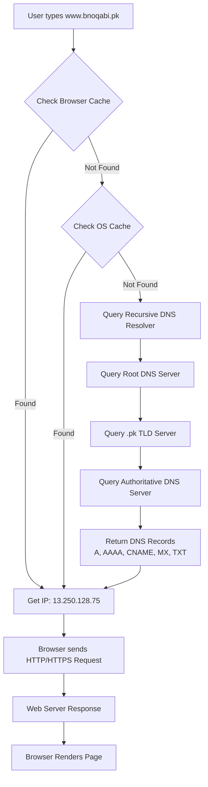

# 📄 Domain, DNS & Hosting
## **1. What is a Domain?**

A **domain** is a unique **human-readable name** used to identify a website or resource on the internet.
Examples:

```
google.com, openai.com, waqarrana.dev
```

📌 **Why do we need domains?**
Because remembering **IP addresses** (like `142.250.183.238`) is difficult, domains provide an easy-to-remember name.

---

## **2. How Does a Domain Work?**

When you type a domain in your browser:

1. Your computer sends a request to a **DNS server**.
2. **DNS (Domain Name System)** translates the domain into an **IP address**.
3. The request is sent to that IP address.
4. The web server returns data.
5. The browser displays the content.

---

## **3. Structure of a Domain**

Example:

```
www.blog.example.com
```

* **Root Domain** – The base of all domains (hidden).
* **Top Level Domain (TLD)** – `.com`, `.org`, `.net`, `.pk`
* **Second Level Domain (SLD)** – `example` (brand or project name).
* **Subdomain** – `www` or `blog` (specific section or service of the site).

---

## **4. Types of Domains**

### **(a) Top-Level Domain (TLD)**

* **Generic (gTLD)** → `.com`, `.org`, `.net`
* **Country Code (ccTLD)** → `.pk` (Pakistan), `.us` (USA)
* **Special TLDs** → `.dev`, `.app` (Google-owned secure TLDs)

### **(b) Second-Level Domain (SLD)**

The main brand or organization name.

### **(c) Subdomain**

Specific service or section.
Example:
`mail.google.com` → Gmail
`blog.example.com` → Blog section

---

## **5. Domain Registration**

To use a domain live:

1. Buy it from a **registrar** (GoDaddy, Namecheap, Google Domains).
2. Registration is typically for one year (renewal required).
3. Each domain has **WHOIS** data with owner info (privacy protection can be enabled).

---

## **6. Name Servers**

A **name server** is a special type of server that stores and provides DNS records for a domain.

### **Types of Name Servers**

1. **Authoritative Name Server**
   Stores the actual DNS records (A, AAAA, CNAME, MX, TXT) and responds to queries.

2. **Recursive Name Server (Resolver)**
   Queries other DNS servers to find the answer for the user. Caches results to speed up responses.

Example:
If `bnoqabi.pk` is hosted on AWS Route53, AWS will provide the **authoritative name servers**.

---

## **7. DNS (Domain Name System)**

DNS is responsible for mapping a **domain** to an **IP address**.

### **Common DNS Records**

* **A Record** → Domain → IPv4 address
  Example: `bnoqabi.pk → 13.250.128.75`

* **AAAA Record** → Domain → IPv6 address
  Example: `bnoqabi.pk → 2406:da1a:1234:abcd::1`

* **CNAME Record** → Domain → Another domain
  Example: `www.bnoqabi.pk → bnoqabi.pk`

* **MX Record** → Mail server address
  Example: `bnoqabi.pk → ASPMX.L.GOOGLE.COM`

* **TXT Record** → Stores text data (verification, SPF, DKIM)
  Example: `"v=spf1 include:_spf.google.com ~all"`

---

## **8. The Complete DNS Resolution Process**

Example: User types `www.bnoqabi.pk` in the browser.

### **Step-by-step**

1. **Browser Cache Check** – If IP is already stored, use it.
2. **OS Cache Check** – If found, use it.
3. **Recursive Resolver** – Usually your ISP’s DNS or public DNS like Google (`8.8.8.8`) or Cloudflare (`1.1.1.1`).
4. **Root DNS Servers** – Direct the query to the relevant TLD server.
5. **TLD DNS Servers** – Direct the query to the authoritative name server.
6. **Authoritative Name Server** – Returns the domain’s DNS records (A, CNAME, MX, etc.).
7. **Browser Connects to IP** – TCP connection on port 80/443.
8. **Web Server Response** – Returns HTML, CSS, JS.
9. **Browser Renders the Page**.

---

## **9. Caching in DNS**

Caching helps speed up the process:

* **Browser Cache** – Stores recently resolved domains.
* **OS Cache** – System-level cache for DNS lookups.
* **Resolver Cache** – DNS resolvers store results to avoid repetitive lookups.

💡 **Flush DNS cache** if you update DNS records but still see old data:

* **Windows:**

  ```
  ipconfig /flushdns
  ```
* **Linux:**

  ```
  sudo systemd-resolve --flush-caches
  ```

---

## **10. CLI DNS Tools**

Check DNS records from terminal:

```bash
# Check A record
nslookup bnoqabi.pk

# Check CNAME record
nslookup www.bnoqabi.pk

# Check MX record
nslookup -type=mx bnoqabi.pk

# Check TXT record
nslookup -type=txt bnoqabi.pk

# Check Name Servers
nslookup -type=ns bnoqabi.pk

# Using dig
dig ns bnoqabi.pk
```

---

## **11. DNS Resolution Diagram**



# Ports, SSL / TLS & SSH

## 1. **Ports**

A **Port** is a **logical endpoint** used to identify a specific service or application running on a device or server.
When data travels over a network:

* **IP Address** → Identifies **which device** should receive the data.
* **Port Number** → Identifies **which application/service** on that device should handle the data.

**Analogy:**

* **IP address** = House address
* **Port number** = Room number inside the house

---

### 1.1 **Port Number Range**

Ports are numbered **0–65535** and are divided into three categories:

1. **Well-known ports (0–1023)** – Reserved for common services.

   | Port | Service | Description          |
   | ---- | ------- | -------------------- |
   | 80   | HTTP    | Websites without SSL |
   | 443  | HTTPS   | Websites with SSL    |
   | 22   | SSH     | Secure remote login  |
   | 25   | SMTP    | Email sending        |

2. **Registered ports (1024–49151)** – Can be registered for specific applications.

3. **Dynamic/Ephemeral ports (49152–65535)** – Temporarily assigned by the OS for short-lived connections.

---

### 1.2 **How Ports Work**

1. You send a request to a server via a domain or IP.
2. The request includes a **port number**.
3. The server’s OS forwards the data to the application listening on that port.

**Example:**

```text
http://example.com:80
https://example.com:443
ssh user@example.com -p 22
```

If no port is specified, the default is used (HTTP = 80, HTTPS = 443).

---

### 1.3 **Common Ports Reference Table**

| Port  | Protocol         | Use                          |
| ----- | ---------------- | ---------------------------- |
| 20/21 | FTP              | File Transfer                |
| 22    | SSH              | Secure remote login          |
| 25    | SMTP             | Email sending                |
| 53    | DNS              | Domain resolution            |
| 80    | HTTP             | Web traffic                  |
| 110   | POP3             | Email receiving              |
| 143   | IMAP             | Email receiving              |
| 443   | HTTPS            | Secure web traffic           |
| 3306  | MySQL            | Database                     |
| 5432  | PostgreSQL       | Database                     |
| 6379  | Redis            | In-memory DB                 |
| 8080  | HTTP alternative | Dev environments/web servers |

---

**Common Commands:**

```bash
# List listening ports
netstat -tulnp
ss -tulnp

# Test a specific port
nc -zv example.com 443

# Test using telnet
telnet example.com 443
```

---

## 2. **SSL / TLS**

**SSL (Secure Sockets Layer)** is a protocol for encrypting internet communication.
It ensures:

1. **Data encryption** – Prevents eavesdropping.
2. **Authentication** – Confirms server identity.
3. **Integrity** – Prevents data tampering.

⚠️ SSL is outdated; today we use **TLS (Transport Layer Security)**, but it’s still called “SSL certificate” in common language.

---

### 2.1 **SSL Certificate**

An SSL certificate is a digital file containing:

* Domain name
* Issuer (Certificate Authority)
* Expiry date
* **Public key** for encryption

Example:

```text
-----BEGIN CERTIFICATE-----
MIIDdzCCAl+gAwIBAgE...
-----END CERTIFICATE-----
```

---

### 2.2 **How HTTPS Uses SSL/TLS**

1. Browser connects to server on **port 443**.
2. Server sends its **SSL certificate**.
3. Browser verifies:

   * Signature (via Certificate Authority)
   * Domain match
   * Validity/expiry
4. If valid:

   * Browser and server perform **TLS handshake**.
   * Session key is generated for encrypted communication.
5. Data is now encrypted and secure.

---

### 2.3 **Types of SSL Certificates**

1. **DV** – Domain Validation
2. **OV** – Organization Validation
3. **EV** – Extended Validation (highest trust)

---

## 3. **HTTPS**

* **HyperText Transfer Protocol Secure** = HTTP + SSL/TLS encryption.
* Uses **port 443**.
* Secures:

  * Web traffic
  * APIs
  * Data transfer

**Example:**

```text
http://example.com   ❌ Not secure
https://example.com  ✅ Secure
```

---

## 4. **SSH (Secure Shell)**

* Secure protocol for remote system access.
* Uses **port 22**.
* Encrypts commands and data.
* DevOps use cases:

  * Server management
  * Deployments
  * Secure file transfer (SCP/SFTP)
  * Git SSH authentication

**Example:**

```bash
ssh user@192.168.1.10
```

---

## 5. **HTTP Status Codes**

HTTP status codes indicate the result of a request.

### **1xx – Informational**

| Code    | Meaning                                                                    |
| ------- | -------------------------------------------------------------------------- |
| **100** | Continue – Server has accepted the initial request, client should continue |
| **101** | Switching Protocols – Request to change protocol accepted                  |
| **102** | Processing – Server is still processing the request (WebDAV)               |
| **103** | Early Hints – Response headers sent first, body will come later            |

---

### **2xx – Success**

| Code    | Meaning                                                           |
| ------- | ----------------------------------------------------------------- |
| **200** | OK – Request successful                                           |
| **201** | Created – A new resource has been created                         |
| **202** | Accepted – Request accepted, but will be processed later          |
| **203** | Non-Authoritative Information – Data is from a third-party source |
| **204** | No Content – Request successful but no content sent               |
| **205** | Reset Content – Client should reset their view                    |
| **206** | Partial Content – Only part of the data sent (range requests)     |
| **207** | Multi-Status – Multiple status values (WebDAV)                    |
| **208** | Already Reported – Avoiding duplicate information (WebDAV)        |
| **226** | IM Used – Result of delta encoding returned                       |

---

### **3xx – Redirection**

| Code    | Meaning                                                            |
| ------- | ------------------------------------------------------------------ |
| **300** | Multiple Choices – Multiple versions of the resource               |
| **301** | Moved Permanently – Resource permanently moved to a new URL        |
| **302** | Found – Temporary redirect                                         |
| **303** | See Other – Fetch the resource using the GET method                |
| **304** | Not Modified – Cache data is still valid, no need to fetch again   |
| **305** | Use Proxy – Access the resource through a proxy                    |
| **306** | (Unused) – Previously used for proxy requirement                   |
| **307** | Temporary Redirect – Redirect using the same method                |
| **308** | Permanent Redirect – Permanent redirect preserving method and body |

---

### **4xx – Client Errors**

| Code    | Meaning                                                       |
| ------- | ------------------------------------------------------------- |
| **400** | Bad Request – Invalid request syntax                          |
| **401** | Unauthorized – Login/Authentication required                  |
| **402** | Payment Required – (Rare, reserved for future use)            |
| **403** | Forbidden – Access not allowed                                |
| **404** | Not Found – Resource does not exist                           |
| **405** | Method Not Allowed – HTTP method not allowed                  |
| **406** | Not Acceptable – Server cannot match client’s Accept headers  |
| **407** | Proxy Authentication Required – Proxy authentication needed   |
| **408** | Request Timeout – Server waited too long                      |
| **409** | Conflict – Conflict in the resource state                     |
| **410** | Gone – Resource permanently deleted                           |
| **411** | Length Required – Content-Length header missing               |
| **412** | Precondition Failed – Condition did not match                 |
| **413** | Payload Too Large – Request body exceeds size limit           |
| **414** | URI Too Long – URL length too long                            |
| **415** | Unsupported Media Type – File format not supported            |
| **416** | Range Not Satisfiable – Requested range not available         |
| **417** | Expectation Failed – Expect header requirement not met        |
| **418** | I'm a Teapot – (Joke code, April Fools, RFC 2324)             |
| **421** | Misdirected Request – Server sent request to the wrong target |
| **422** | Unprocessable Entity – Semantic errors (WebDAV)               |
| **423** | Locked – Resource locked (WebDAV)                             |
| **424** | Failed Dependency – Previous request failed (WebDAV)          |
| **425** | Too Early – Risk in processing the request                    |
| **426** | Upgrade Required – Client must upgrade the protocol           |
| **428** | Precondition Required – Missing precondition in request       |
| **429** | Too Many Requests – Client exceeded request limit             |
| **431** | Request Header Fields Too Large – Header size too large       |
| **451** | Unavailable For Legal Reasons – Blocked due to legal reasons  |

---

### **5xx – Server Errors**

| Code    | Meaning                                                                |
| ------- | ---------------------------------------------------------------------- |
| **500** | Internal Server Error – Server code crashed                            |
| **501** | Not Implemented – Feature not supported                                |
| **502** | Bad Gateway – Issue with proxy server                                  |
| **503** | Service Unavailable – Server overload or maintenance                   |
| **504** | Gateway Timeout – Server took too long to respond                      |
| **505** | HTTP Version Not Supported – Protocol version not supported            |
| **506** | Variant Also Negotiates – Configuration loop detected                  |
| **507** | Insufficient Storage – Not enough space on the server (WebDAV)         |
| **508** | Loop Detected – Infinite loop detected (WebDAV)                        |
| **510** | Not Extended – More extensions required                                |
| **511** | Network Authentication Required – Network login needed (Wi-Fi portals) |

---

## 6. **CORS (Cross-Origin Resource Sharing)**

### 6.1 **The Problem**

Browsers follow **Same-Origin Policy** –
A website can only request resources from the same domain unless explicitly allowed.

---

### 6.2 **How CORS Works**

* The target server sends **CORS headers** to allow cross-origin requests.
* Example:

```http
Access-Control-Allow-Origin: https://myapp.com
```

---

### 6.3 **Preflight Requests**

For certain requests, the browser first sends an `OPTIONS` request to check:

* Allowed origins
* Allowed methods
* Allowed headers

---

### 6.4 **Common CORS Headers**

| Header                           | Purpose                                 |
| -------------------------------- | --------------------------------------- |
| Access-Control-Allow-Origin      | Specifies allowed origins               |
| Access-Control-Allow-Methods     | Specifies allowed HTTP methods          |
| Access-Control-Allow-Headers     | Specifies allowed custom headers        |
| Access-Control-Allow-Credentials | Whether cookies/credentials can be sent |

---

### 6.5 **Example in Node.js**

```javascript
import express from 'express';
import cors from 'cors';

const app = express();

app.use(cors({
  origin: 'https://myapp.com',
  methods: ['GET', 'POST'],
  credentials: true
}));

app.get('/data', (req, res) => {
  res.json({ message: 'CORS enabled!' });
});

app.listen(3000);
```

