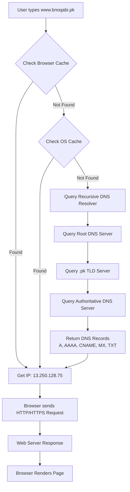

# 📄 README – Domain, DNS & Hosting

## **1. What is a Domain?**

A **domain** is a unique **human-readable name** used to identify a website or resource on the internet.
Examples:

```
google.com, openai.com, waqarrana.dev
```

📌 **Why do we need domains?**
Because remembering **IP addresses** (like `142.250.183.238`) is difficult, domains provide an easy-to-remember name.

---

## **2. How Does a Domain Work?**

When you type a domain in your browser:

1. Your computer sends a request to a **DNS server**.
2. **DNS (Domain Name System)** translates the domain into an **IP address**.
3. The request is sent to that IP address.
4. The web server returns data.
5. The browser displays the content.

---

## **3. Structure of a Domain**

Example:

```
www.blog.example.com
```

* **Root Domain** – The base of all domains (hidden).
* **Top Level Domain (TLD)** – `.com`, `.org`, `.net`, `.pk`
* **Second Level Domain (SLD)** – `example` (brand or project name).
* **Subdomain** – `www` or `blog` (specific section or service of the site).

---

## **4. Types of Domains**

### **(a) Top-Level Domain (TLD)**

* **Generic (gTLD)** → `.com`, `.org`, `.net`
* **Country Code (ccTLD)** → `.pk` (Pakistan), `.us` (USA)
* **Special TLDs** → `.dev`, `.app` (Google-owned secure TLDs)

### **(b) Second-Level Domain (SLD)**

The main brand or organization name.

### **(c) Subdomain**

Specific service or section.
Example:
`mail.google.com` → Gmail
`blog.example.com` → Blog section

---

## **5. Domain Registration**

To use a domain live:

1. Buy it from a **registrar** (GoDaddy, Namecheap, Google Domains).
2. Registration is typically for one year (renewal required).
3. Each domain has **WHOIS** data with owner info (privacy protection can be enabled).

---

## **6. Name Servers**

A **name server** is a special type of server that stores and provides DNS records for a domain.

### **Types of Name Servers**

1. **Authoritative Name Server**
   Stores the actual DNS records (A, AAAA, CNAME, MX, TXT) and responds to queries.

2. **Recursive Name Server (Resolver)**
   Queries other DNS servers to find the answer for the user. Caches results to speed up responses.

Example:
If `bnoqabi.pk` is hosted on AWS Route53, AWS will provide the **authoritative name servers**.

---

## **7. DNS (Domain Name System)**

DNS is responsible for mapping a **domain** to an **IP address**.

### **Common DNS Records**

* **A Record** → Domain → IPv4 address
  Example: `bnoqabi.pk → 13.250.128.75`

* **AAAA Record** → Domain → IPv6 address
  Example: `bnoqabi.pk → 2406:da1a:1234:abcd::1`

* **CNAME Record** → Domain → Another domain
  Example: `www.bnoqabi.pk → bnoqabi.pk`

* **MX Record** → Mail server address
  Example: `bnoqabi.pk → ASPMX.L.GOOGLE.COM`

* **TXT Record** → Stores text data (verification, SPF, DKIM)
  Example: `"v=spf1 include:_spf.google.com ~all"`

---

## **8. The Complete DNS Resolution Process**

Example: User types `www.bnoqabi.pk` in the browser.

### **Step-by-step**

1. **Browser Cache Check** – If IP is already stored, use it.
2. **OS Cache Check** – If found, use it.
3. **Recursive Resolver** – Usually your ISP’s DNS or public DNS like Google (`8.8.8.8`) or Cloudflare (`1.1.1.1`).
4. **Root DNS Servers** – Direct the query to the relevant TLD server.
5. **TLD DNS Servers** – Direct the query to the authoritative name server.
6. **Authoritative Name Server** – Returns the domain’s DNS records (A, CNAME, MX, etc.).
7. **Browser Connects to IP** – TCP connection on port 80/443.
8. **Web Server Response** – Returns HTML, CSS, JS.
9. **Browser Renders the Page**.

---

## **9. Caching in DNS**

Caching helps speed up the process:

* **Browser Cache** – Stores recently resolved domains.
* **OS Cache** – System-level cache for DNS lookups.
* **Resolver Cache** – DNS resolvers store results to avoid repetitive lookups.

💡 **Flush DNS cache** if you update DNS records but still see old data:

* **Windows:**

  ```
  ipconfig /flushdns
  ```
* **Linux:**

  ```
  sudo systemd-resolve --flush-caches
  ```

---

## **10. CLI DNS Tools**

Check DNS records from terminal:

```bash
# Check A record
nslookup bnoqabi.pk

# Check CNAME record
nslookup www.bnoqabi.pk

# Check MX record
nslookup -type=mx bnoqabi.pk

# Check TXT record
nslookup -type=txt bnoqabi.pk

# Check Name Servers
nslookup -type=ns bnoqabi.pk

# Using dig
dig ns bnoqabi.pk
```

---

## **11. DNS Resolution Diagram**

